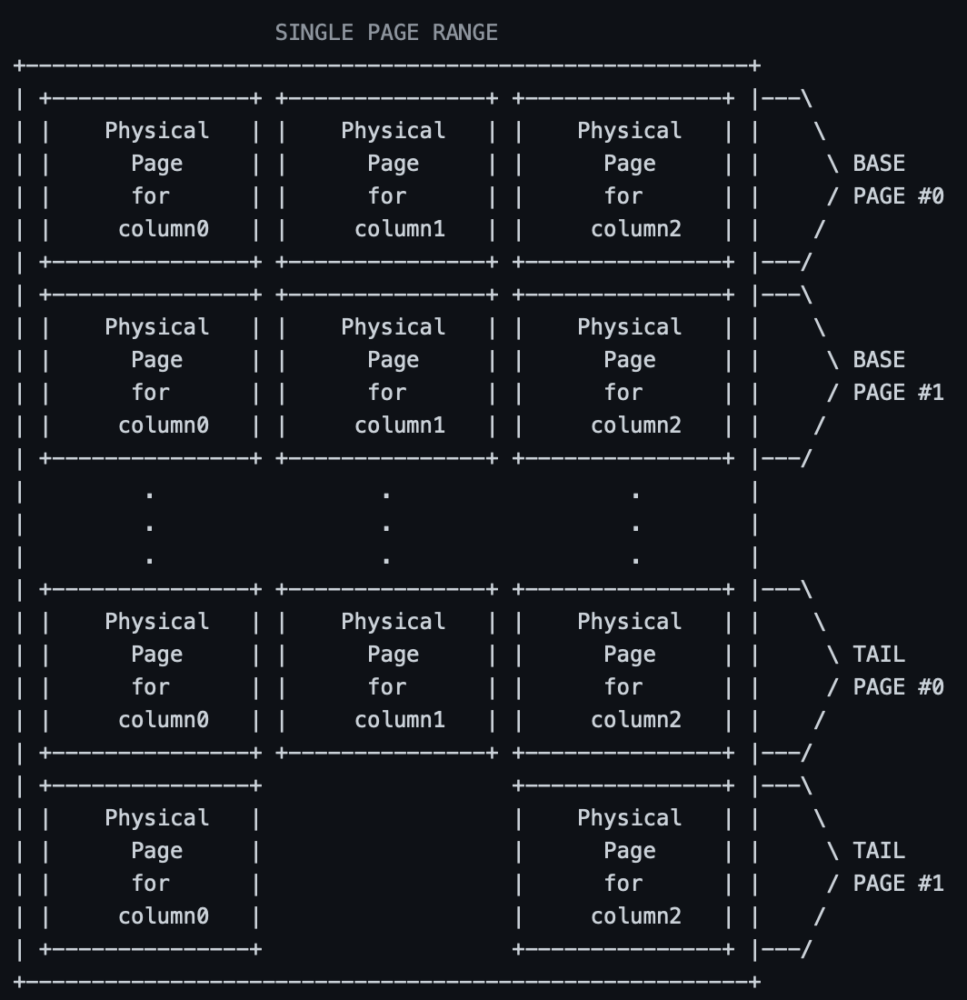

# How things work

## Page Directory

The Page Directory maps a record RID to the page it resides in.

- This class holds the page ranges for the given table.

### Setup:
- sudo pip install colorama (make sure this package is on your machine)

### Notes

- The Page Directory Class holds the page ranges, not the table class.

## Page Range

The Page Range encompasses the base pages and tails pages of a table.

At first we create a set of base pages (let's say 16) and a single tail page for each column.

"Each base page (or tail page) consists of a set of physical pages (4 KB each), <b>one for each column</b>."

### Notes

- Starts with only 1 tail page at first. Add more as you fill them up
- Records are spread out over these pages.
-

## Record

### Attributes

- RID: Record ID
- Indirection column: Stores the RID of the latest updated record. None if it is a base record and no updates have been done. If a tail record, points to the previous tail record
- Schema Encoding Column: a bitmap (bit vector) with size equal to the number of columns. Tells us if a column has been updated. 0 if not updated, 1 if updated.
- Timestamp Column: the time at which it was created.

### Notes

- The schema encoding column in a tail record is useless for us since we are doing the cumulative approach to tail records.
- A record can be a base record or a tail record depending if it is stored in a base page or a tail page.
-

## Base Page

- Read-Only
- Only add record to base page if it a new record
- Consists of a set of physical pages, one for each column of the table.

